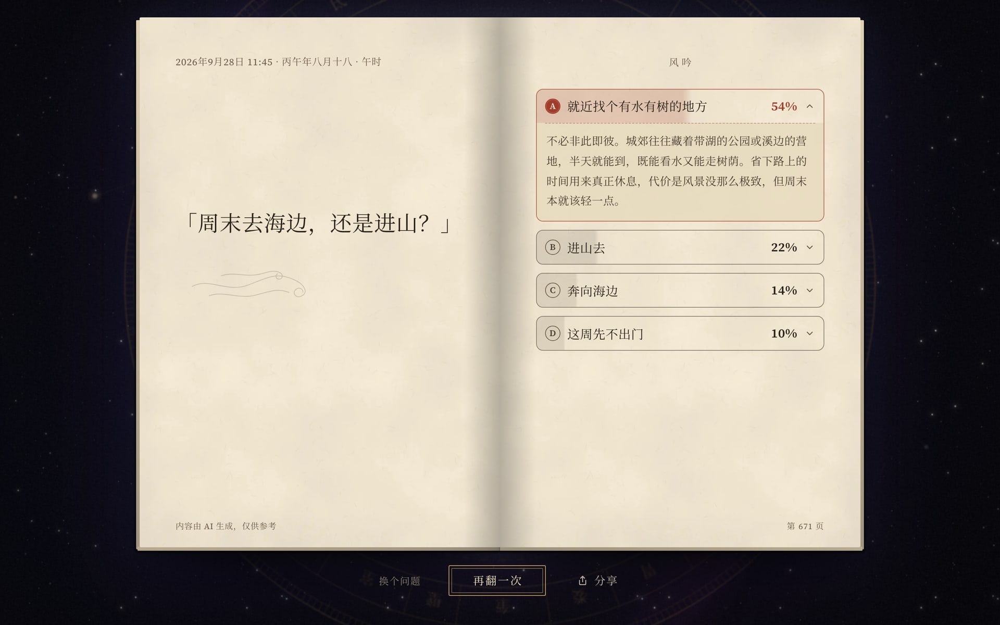
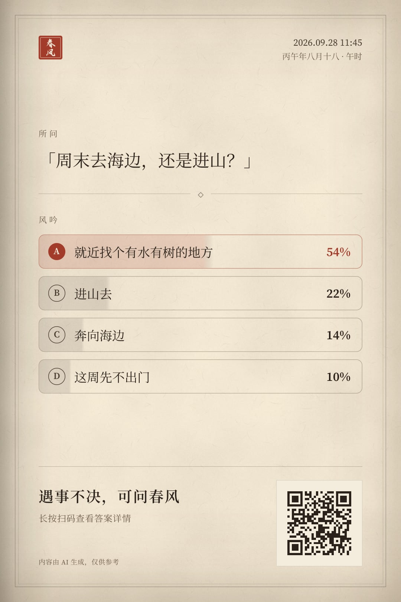
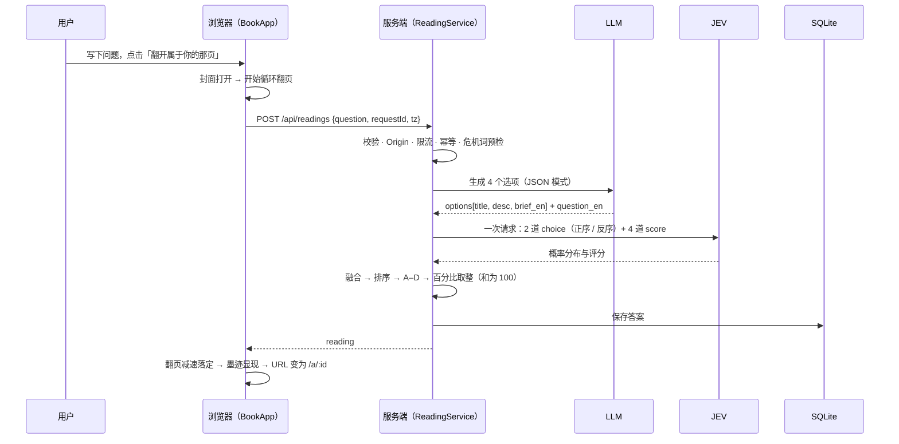

<p align="center">
  
</p>

<h1 align="center">春风</h1>

<p align="center">
  <b>遇事不决，可问春风。</b><br>
  一本会回答问题的魔法书：写下你的困惑，翻开属于你的那一页。
</p>

<p align="center">
  
  
  
  
  
  
</p>

<p align="center">
  
</p>

---

「春风」的玩法类似「答案之书」，但不只给一句箴言。你写下一个问题，大语言模型给出**四条可以走的路**，每条都附有说明；再由 **JEV 决策模型**为这四条路评分，按分数从高到低排成 A、B、C、D，并标出各自的占比。

## 目录

- [截图](#截图)
- [特性](#特性)
- [工作原理](#工作原理)
- [快速开始](#快速开始)：本地体验 · 部署到生产环境（Docker / Node）
- [配置](#配置)
- [常用命令](#常用命令)
- [项目结构](#项目结构)
- [开发文档](#开发文档)
- [致谢与声明](#致谢与声明)

## 截图

**横屏答案页**：左页是提问，右页是按评分排序的四条路；点开一条，下方展开春风的说明。

<p align="center">
  
</p>

**分享图**：单页书页样式，带提问时间、提问内容、四个选项与评分，底部的二维码可直达这一页。

<p align="center">
  
</p>

> 截图为 1440 × 900 视口（2× 像素密度）。竖屏设备上答案页为单页：提问、分割线、四条路自上而下排列。

## 特性

- **一本真正的书**：午夜蓝皮面、烫金书名，封面用 CSS 3D 刚性翻开；纸页用 three.js 自研的**圆柱卷曲着色器**一页页翻过，直到答案就绪才减速落定。不支持 WebGL 时自动降级为 CSS 引擎，开启「减少动态效果」时只做淡入淡出。
- **墨迹显现**：答案始终是 DOM（可选中、可访问），在最后一页空白纸上像墨迹一样浮现。
- **克制的背景**：星旋、星盘、北斗与风中微粒，翻页时略微活跃，平时安静；不可见即暂停，弱机自动切到轻量档。
- **四条路 + 评分**：LLM（DeepSeek，JSON 输出）生成选项；JEV 在一次请求中完成 2 道 choice（正序 / 反序，抵消位置偏差）与 4 道 score，融合为占比，四项百分比之和恰为 100。
- **竖屏单页 / 横屏双页**：同一套组件随视口切换版式；选项点开显示说明，与选项共用一圈外框。
- **再翻一次**：同一个问题换个角度，重新给出四条路。
- **分享**：服务端用 `next/og`（satori + resvg）渲染书页样式的分享图，内嵌二维码；微信内可长按保存、扫码直达。
- **图片提问**（可选）：设置 `LLM_VISION=true` 后可附一张图片一起提问。图片在服务端重编码（摆正方向、去除 EXIF / GPS），会出现在答案页与分享图中。
- **稳**：`requestId` 幂等、LLM 结果缓存（JEV 失败时只补做 JEV）、共享 deadline 下的分级重试、按 IP 限流；危机类提问会转为求助资源页。
- **隐私**：密钥只在服务端；日志默认不记录提问原文，IP 只存加盐哈希。

## 工作原理



- 浏览器只和自己的服务端通信，从不直接访问 LLM 或 JEV。
- LLM 顺带输出英文的 `question_en` 与 `brief_en` 交给 JEV，因为 JEV 对中日韩文字的准确率较低。
- 无法作答的提问（含糊、敏感、被拒）不调用 JEV、不落库，直接返回对应的提示页。
- 答案存入 SQLite，`/a/[id]` 服务端渲染，扫码即开。

## 快速开始

### 本地体验

环境要求：macOS 或 Ubuntu，Node.js 22+（生产推荐 24 LTS），pnpm 10。

```bash
pnpm install

# 无需任何外部服务：使用模拟的 LLM 与 JEV
pnpm dev:mock
```

打开 <http://localhost:3000>，写下一个问题即可。

要接入真实的上游：

```bash
cp .env.example .env    # 填写 LLM_API_KEY、JEV_API_KEY 等

pnpm check:upstreams    # 检查 LLM 与 JEV 的连通性
pnpm dev
```

### 部署到生产环境

服务器为 Ubuntu（macOS 同样可用）。先取代码，在仓库根目录写好 `.env`（下面的命令都在仓库根目录执行，`$(pwd)` 即仓库根目录）：

```bash
git clone <仓库地址> /opt/chunfeng && cd /opt/chunfeng

cp .env.example .env && chmod 600 .env    # 按下面的最简配置填写
mkdir -p data                             # 数据库、分享图缓存与上传图片（已 .gitignore / .dockerignore 排除）
```


**生产环境最简 `.env`**：下面 7 项缺任何一项，服务都会拒绝启动并报出缺少的变量名。其余配置项都有默认值，见[配置](#配置)。

```ini
# LLM：OpenAI 兼容的 chat/completions 完整地址
LLM_API_URL=https://api.deepseek.com/chat/completions
LLM_API_KEY=<你的 DeepSeek API Key>
LLM_MODEL=deepseek-flash

# JEV：TypeSafe System One 协议（模型默认 jev-1.13-free）；应用服务器必须能访问这个地址
## 模型来源可以使用(白嫖) opencode2api: https://github.com/jasonxu114514/opencode2api
JEV_API_URL=http://localhost:8080/v1/systemone
JEV_API_KEY=<你的 JEV API Key>

# IP 哈希用的盐，不能沿用 change-me；生成方法：openssl rand -hex 32
IP_HASH_SALT=<随机串>
```

然后从下面两种方式中任选一种。两种方式都只监听 `127.0.0.1:3000`，对外由 nginx 提供 HTTPS 与限流。

#### 方式一：Docker（推荐）

服务器只需安装 Docker，不需要 Node、pnpm 与编译工具。镜像用 CI 构建好的 `ghcr.io/gavingoo/chunfeng:latest`。

容器以镜像内 uid 1000 的 `node` 用户运行，它要能读 `.env`、能写 `data/`。**绑定挂载不改变宿主文件的属主与权限**：上面 `chmod 600` 之后 `.env` 的属主必须是 uid 1000，否则容器里读不到（详见下面的症状）。在仓库根目录核对：

```bash
ls -lnd .env data                         # 第 3、4 列应为 1000 1000
sudo chown 1000:1000 .env                 # 不是就改属主，权限保持 600
sudo chown -R 1000:1000 data
```

>  属主不符时的症状：日志先出现 `Failed to load env from .env` 与 `EACCES: permission denied, open '/app/.env'`，紧接着 `[chunfeng] 配置无效或缺失，请检查环境变量：…` 并以退出码 1 结束

```bash
docker pull ghcr.io/gavingoo/chunfeng:latest

docker run -d --restart unless-stopped --name chunfeng \
  -p 127.0.0.1:3000:3000 \
  -v "$(pwd)/data:/app/data" \
  -v "$(pwd)/.env:/app/.env:ro" \
  ghcr.io/gavingoo/chunfeng:latest

docker logs -f chunfeng                       # 查看日志
```

更新：`docker pull ghcr.io/gavingoo/chunfeng:latest && docker rm -f chunfeng` 后重跑上面那条 `docker run`；只改了 `.env` 则 `docker restart chunfeng` 即可。

#### 方式二：直接用 Node

服务器需要安装 Node.js 24、pnpm（`corepack enable`）、`build-essential` 与 `python3`，后两者用于编译 better-sqlite3。

```bash
pnpm install --frozen-lockfile && pnpm build
pnpm start                                    # 前台试跑，确认能启动后按 Ctrl+C 退出
```

用仓库里的 systemd 服务常驻运行。先把 [`deploy/chunfeng.service`](deploy/chunfeng.service) 里的 `User`、`WorkingDirectory` 改成你的用户和仓库目录：

```bash
sudo cp deploy/chunfeng.service /etc/systemd/system/
sudo systemctl daemon-reload && sudo systemctl enable --now chunfeng
git pull && pnpm install --frozen-lockfile && pnpm build && sudo systemctl restart chunfeng   # 更新
journalctl -u chunfeng -f                                                                  # 查看日志
```

数据在仓库目录下的 `./data`。启动时会出现一行「`next start` does not work with `output: standalone`」警告，不影响运行，可以忽略。

#### nginx 与 HTTPS（两种方式通用）

```bash
sudo cp deploy/nginx.conf <nginx_conf>/vhost/<DOMAIN>.conf   # 主配置的 http { } 里要有 include vhost/*.conf;
vim <nginx_conf>/vhost/<DOMAIN>.conf		# 修改模板配置
sudo nginx -t && sudo nginx -s reload
```

部署完成后，访问 `https://<DOMAIN>/api/health`，返回正常即表示服务已就绪。更多细节（防火墙、内网 JEV 网关的连通性检查、手动备份）见[部署与运维](.agents/modules/13-deployment.md)。

## 配置

全部配置来自根目录的 `.env`，启动时用 zod 校验；缺少必填项会启动失败并列出缺失的变量名（不打印值）。模板见 [`.env.example`](.env.example)。

| 变量 | 默认 | 说明 |
|---|---|---|
| `LLM_API_URL` / `LLM_API_KEY` / `LLM_MODEL` | — | OpenAI 兼容的 `chat/completions` 完整 endpoint、密钥与模型名（必填） |
| `JEV_API_URL` / `JEV_API_KEY` / `JEV_MODEL` | — / — / `jev-1.13-free` | TypeSafe Jev（`/v1/systemone`）的 endpoint、密钥与模型名 |
| `IP_HASH_SALT` | — | IP 加盐哈希的盐（生产必填） |
| `DATABASE_PATH` | `./data/chunfeng.db` | SQLite 文件 |
| `SHARE_CACHE_DIR` | `./data/share-cache` | 分享图磁盘缓存（一篇答案一张图） |
| `LLM_VISION` | `false` | 图片提问开关；要求 `LLM_MODEL` 接受图片输入 |
| `IMAGE_DIR` | `./data/images` | 上传图片目录 |
| `SCORING_BLEND_WEIGHT` / `SCORING_SOFTMAX_TAU` | `0.6` / `0.25` | 评分融合参数（由校准定稿） |
| `RATE_LIMIT_PER_MIN` / `RATE_LIMIT_PER_DAY` | `8` / `100` | 单 IP 提问限流 |
| `READING_TTL_DAYS` | `0` | 答案保留天数，`0` 为永久 |
| `MOCK_UPSTREAMS` | `false` | `true` 时使用模拟上游 |

完整列表见 [总体架构 §8](.agents/modules/01-architecture.md#8-配置项env)。

> `.env` 含密钥，已被 `.gitignore` 与 `.dockerignore` 排除，请勿提交。

## 常用命令

| 命令 | 作用 |
|---|---|
| `pnpm dev` / `pnpm dev:mock` | 本地开发（真实上游 / 模拟上游） |
| `pnpm lint` / `pnpm typecheck` / `pnpm test` | Biome 检查、类型检查、单元与集成测试（Vitest） |
| `pnpm test:e2e` | 端到端测试（Playwright，同时验证 `LLM_VISION` 开与关） |
| `pnpm check:upstreams` | 检查 LLM 与 JEV 的连通性 |
| `pnpm eval:options` | 评测 LLM 选项生成的质量（`--vision` 评测带图提问） |
| `pnpm calibrate:scoring` | 校准 JEV 评分的融合参数 |
| `pnpm build:fonts` | 生成 UI 子集字体 |
| `pnpm build:seal` | 生成印章 PNG（og:image、网页图标、iOS 主屏图标） |
| `pnpm perf:probe` | 前端性能探针（渲染与 GPU 开销） |
| `pnpm build` / `pnpm start` | 生产构建（standalone）与启动 |

## 项目结构

```
src/
  app/            页面（/、/a/[id]）与 API 路由（/api/readings、/api/uploads、/api/health）
  components/     book 书本舞台 · flip 翻页引擎 · answer 答案页 · share 分享弹层 · ambient 背景 · ui
  server/         llm · jev · reading 编排 · share 分享图 · image 图片处理 · safety · http · mock
  lib/            前后端共享的类型、校验与工具
  copy/zh.ts      全部界面文案（也用于生成 UI 子集字体）
assets/           服务端字体与分享图素材
public/           子集字体、纹理、印章
scripts/          连通性检查、评测、校准、字体 / 纹理 / 印章构建、性能探针
tests/            unit · integration · e2e
deploy/           nginx 站点配置与 systemd 服务
docs/screenshots/ README 截图
.agents/          设计与开发文档
```

## 致谢与声明

- 正文字体 [Source Serif 4](https://github.com/adobe-fonts/source-serif) 与 [思源宋体（Noto Serif SC）](https://github.com/notofonts/noto-cjk)，书名字体 [玄宗体（Zi-XuanZongTi）](https://github.com/kaonashi-tyc/Zi-XuanZongTi)，均采用 SIL Open Font License 1.1。
- 选项生成：[DeepSeek](https://api-docs.deepseek.com/)；评分：[TypeSafe Jev](https://docs.typesafe.ai/)。
- [opencode2api](https://github.com/jasonxu114514/opencode2api)：JEV 经由它提供的网关接入。
- 春风给出的内容由 AI 生成，仅供参考；重要的决定，请结合实际情况，必要时咨询专业人士。
